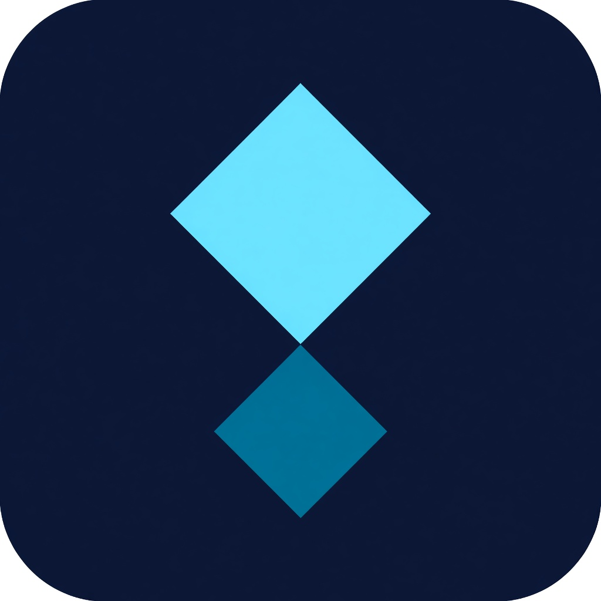
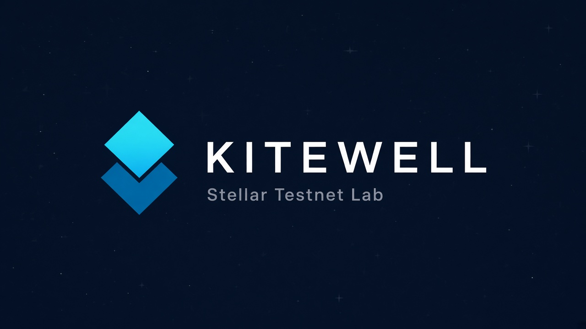

<p align="center">
  
</p>

<h1 align="center">Kitewell</h1>

<p align="center">
  <strong>Stellar Testnet lab</strong> — Freighter wallet UX, Horizon API, and a Soroban builder registry.
</p>

<p align="center">
  
</p>

Kitewell is the three-layer stack for [Stellar Wave / Drips](https://www.drips.network/wave/stellar) contributors. Connect a Freighter wallet, fund on Testnet, manage trustlines, send XLM, and check in on-chain.

## Repositories

| Layer | Repo | Role |
|-------|------|------|
| **Frontend** | [frontend](https://github.com/ayyldCem-0/frontend) | React + Vite + Freighter wallet lab |
| **Backend** | [backend](https://github.com/ayyldCem-0/backend) | Express API — Horizon helpers, network + contract config |
| **Contract** | [contract](https://github.com/ayyldCem-0/contract) | Soroban registry (`register` / `get_builder` / `lab_name`) |

## Quick start

```bash
# terminal 1
git clone https://github.com/ayyldCem-0/backend.git
cd backend && npm install && npm run dev

# terminal 2
git clone https://github.com/ayyldCem-0/frontend.git
cd frontend && npm install && npm run dev
```

Freighter must be on **Testnet**. Open http://localhost:5173.

## Also in this org

[Helios Lab](https://github.com/ayyldCem-0/helios-lab) is a separate Wave submission (monorepo). Kitewell is the split frontend / backend / contract project.

## License

MIT across Kitewell repos. Testnet only by default — no Mainnet funds.
